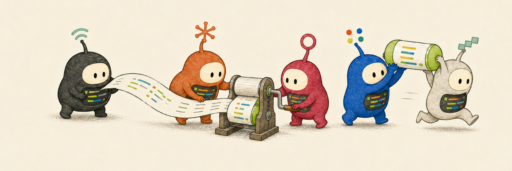

<h1 align="center">CatchUp — coding-agent context handoff</h1>

<div align="center">

### Context handoff for AI coding agents — resume a session in another agent



</div>

`catchup` is a local-first CLI that hands off session context between AI coding agents. When one hits a usage limit — or you switch tools mid-task — it reads the local session into clean Markdown, and `catchup fork` resumes the work in the same agent or a different one: hand a Claude Code session to Codex, a Cursor session to OpenCode, and so on.

Use it whenever you don't want to explain the whole job again — you hit an agent's usage limit, switch tools mid-task, pick up older work, or want a clean record of what happened.

Works with **Claude Code**, **Codex**, **Cursor**, **Cline**, **Kimi**, **Antigravity**, **OpenCode**, and **Pi Agent**.

<div align="center">

**Claude Code hits its usage limit. One command hands the session to Codex.**


**For older work, search sessions by keyword and open the matching one.**


</div>

## Install

```bash
# Homebrew
brew install wilbeibi/tap/catchup

# prebuilt binary (Linux/macOS, no Go needed)
curl -fsSL https://raw.githubusercontent.com/wilbeibi/catchup/main/scripts/install.sh | sh

# or with Go
go install github.com/wilbeibi/catchup@latest

catchup install-skill          # optional: install the agent skill
catchup install-skill <agent>  # ...or for one agent only
```

Windows binaries are on the [releases page](https://github.com/wilbeibi/catchup/releases).

Restart the agent, then ask it to catch up on the last session.

I use `catchup` with [herdr](https://herdr.dev) day to day. The [wilbeibi/herdr-catchup](https://github.com/wilbeibi/herdr-catchup) plugin adds pane actions for summary, fork, and handoff:

```bash
herdr plugin install wilbeibi/herdr-catchup
```

## Usage

Agents: `claude` · `codex` · `cursor` · `cline` · `kimi` · `agy` (Antigravity) · `opencode` · `pi-agent`

Omit `<agent>` and catchup uses whichever agent has the newest session in this directory. Inside a live session, that's usually the session you're in.

**For you:** run in your terminal to re-enter a session:

```bash
catchup fork                     # fork the newest session across agents
catchup fork <agent>             # fork that agent's newest session
catchup fork codex --into claude # continue a Codex session in Claude
```

**For agents:** run inside a session to read prior work:

```bash
catchup <agent> --since-compact  # another agent's latest, since compaction
catchup --since-compact          # this session's context after a compaction
catchup <agent> --list           # list recent sessions
catchup <agent> -q "auth"        # search sessions
catchup <agent>/3                # read 3rd newest session
catchup <agent> --id <id>        # read exact session

catchup <agent> --last 4         # read last 4 exchanges
catchup <agent> --json           # render JSON; also --html
```

Use `fork` to continue with the same agent and keep native session state. Use `fork --into` to start another agent with the transcript. Use read commands when you want old work in a clean context.

## Boundaries

- One agent at a time. It does not merge histories.
- Conversation only. It strips tool calls, command output, and reasoning traces.
- Read-only, except `fork`.
- Same-agent `fork` uses the agent's native resume path, so it keeps real session state.
- Cross-agent `fork --into` seeds the new agent with a transcript, not native state.

## License

MIT
